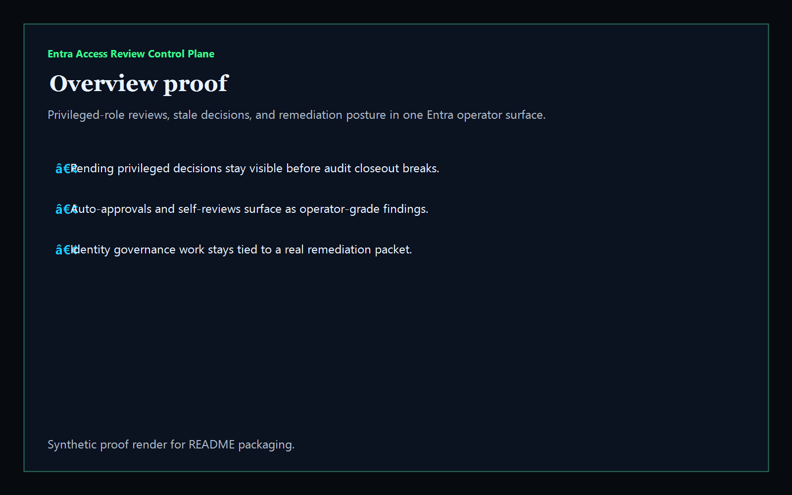
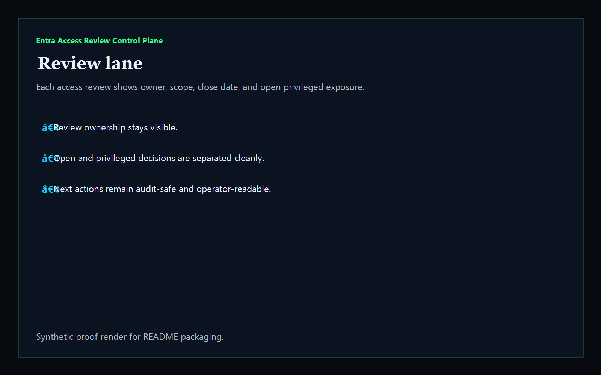
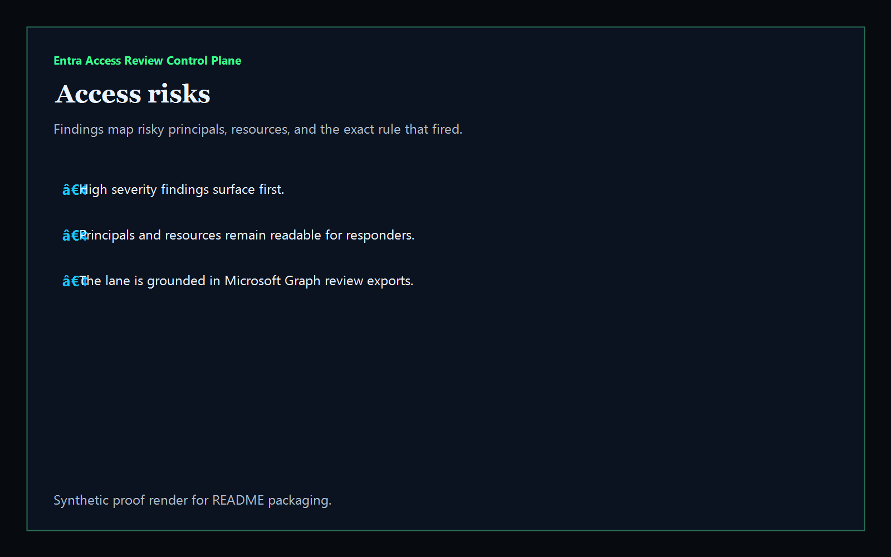
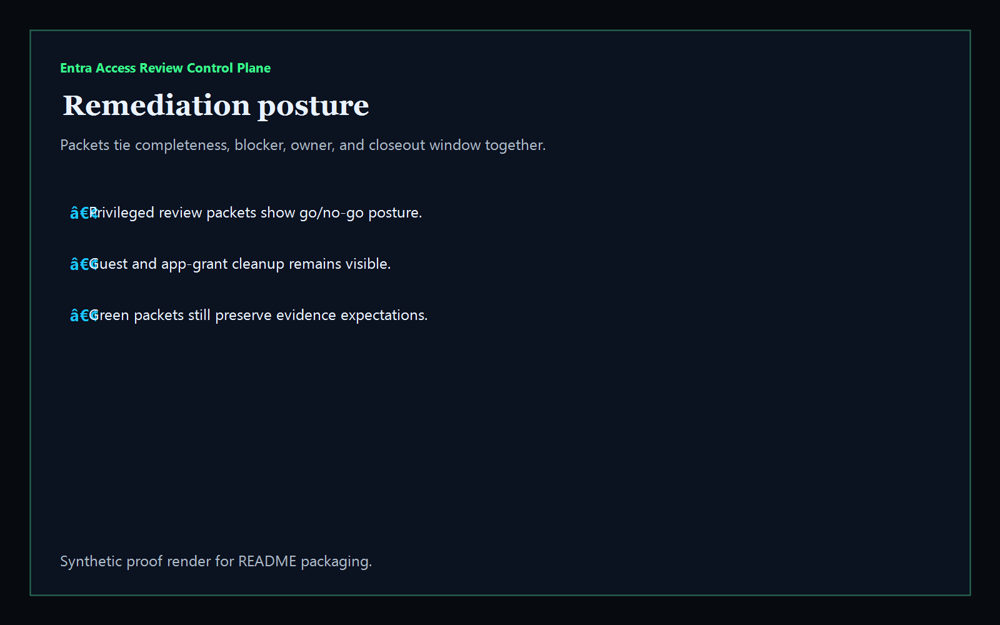

# Entra Access Review Control Plane

[](https://github.com/mizcausevic-dev/entra-access-review-control-plane/actions/workflows/ci.yml)
[](./LICENSE)
[](https://github.com/mizcausevic-dev/entra-access-review-control-plane/actions/workflows/pages.yml)

Operator control plane for Microsoft Entra access reviews, privileged-role decisions, stale approvals, and identity-governance remediation posture.

## Why this exists

- Enterprise teams need more than a raw Microsoft Graph export when audits, access reviews, and remediation timing collide.
- Access-review operators need one surface that shows overdue privileged decisions, self-reviews, auto-approvals, stale-but-not-applied changes, and review ownership.
- Recruiters and buyers looking for `Azure / Microsoft 365 / Entra / Intune` proof should see an admin/operator dashboard, not a cloud tutorial.
- Identity governance work is most valuable when it becomes a visible release and remediation system for platform, security, and audit teams.

## Why this matters (KG Embedded tie-back)

This repo demonstrates the identity-governance control-plane primitive for Microsoft tenant operations: access reviews, privileged-role risk, stale application posture, and buyer-readable remediation packets in one operator surface. Kinetic Gain Embedded extends this pattern into productized in-app dashboards where security, audit, and platform signals need to be visible without exposing unsafe write paths or tenant secrets. See [kineticgain.com/embedded](https://kineticgain.com/embedded).

## What it shows

- review-lane visibility for Entra access-review instances and ownership
- privileged-role risk detection using Microsoft role template ids
- stale decision and overdue closeout posture
- remediation packets for privileged access, guest access, and app-consent review flows
- offline-safe analysis of captured Microsoft Graph exports

## Routes

- `/`
- `/review-lane`
- `/access-risks`
- `/remediation-posture`
- `/verification`
- `/docs`

## API

- `/api/dashboard/summary`
- `/api/review-lane`
- `/api/access-risks`
- `/api/remediation-posture`
- `/api/verification`
- `/api/sample`

## Screenshots






## Local Development

```powershell
cd entra-access-review-control-plane
npm install
npm run dev
```

Open:
- [http://127.0.0.1:5511/](http://127.0.0.1:5511/)
- [http://127.0.0.1:5511/review-lane](http://127.0.0.1:5511/review-lane)
- [http://127.0.0.1:5511/access-risks](http://127.0.0.1:5511/access-risks)
- [http://127.0.0.1:5511/remediation-posture](http://127.0.0.1:5511/remediation-posture)
- [http://127.0.0.1:5511/verification](http://127.0.0.1:5511/verification)

## Validation

- `npm run lint`
- `npm run typecheck`
- `npm run coverage`
- `npm run build`
- `npm run demo`
- `npm run smoke`
- `npm run prerender`
- `npm run render:assets`

## Production status

| Aspect | Status |
|--------|--------|
| CI | Node 20 + 22 matrix — lint · typecheck · coverage · build · demo · smoke · `npm audit` |
| License | [AGPL-3.0-or-later](./LICENSE) |
| Deploy | Static prerender -> **https://entra.kineticgain.com/** |
| Data posture | Synthetic sample data only; no tenant credentials or live Graph tokens |
| Suite | Part of the [Kinetic Gain Protocol Suite](https://suite.kineticgain.com/) operator portfolio · apex: [kineticgain.com](https://kineticgain.com) |

## Docs

- [Architecture](./docs/architecture.md)
- [Origin](./docs/ORIGIN.md)
- [Kinetic Gain Embedded tie-back](./docs/KINETIC_GAIN_EMBEDDED.md)
- [Changelog](./CHANGELOG.md)
